# 🧘‍♀️ Club de Pilates & Yoga — Sistema de Gestión y BI

## 📋 Descripción del Sistema
Este sistema fue desarrollado para un estudio boutique de bienestar con el fin de controlar de manera integral el registro de miembros, la vigencia de sus pases, la agenda de clases y la facturación. La aplicación conecta una interfaz ágil en Streamlit con una base de datos en Oracle Cloud, permitiendo consultar métricas operativas y registrar transacciones financieras en tiempo real.

---

## 👥 Integrantes

| Nombre | Rol |
|--------|-----|
| Manuela Giraldo | Diseño de modelo de datos, DDL/DML y restricciones de integridad |
| Sophia Mateus | Desarrollo de la interfaz en Streamlit, lógica de conexión y documentación |

---

## 🏢 Justificación del Dominio Elegido
Elegimos el dominio de un **estudio de Pilates y Yoga** porque representa un modelo de negocio con reglas operativas dinámicas que se prestan perfectamente para un análisis de Business Intelligence:

- **Segmentación real de clientes:** Los miembros se clasifican según su momento en el embudo (Activo, Inactivo o Potencial), lo que permite evaluar tasas de conversión y reactivación.
- **Flexibilidad en planes de acceso (6 tipos de pases):** El negocio no se limita a mensualidades tradicionales; el modelo soporta pases mensuales por disciplina (Pilates o Yoga), planes de fidelización de largo plazo (VIP Anual), pases diarios (Daily Pass) para clientes de paso y cortesías de enganche sin costo.
- **Control de aforo y agenda:** Las clases están topadas según la capacidad física del estudio y se dividen en 5 disciplinas específicas (Reformer Pilates, Mat Pilates, Mat Yoga, Hot Yoga y Puppy Yoga).
- **Penalizaciones automatizadas:** Las inscripciones no solo reservan el cupo, sino que actúan como el validador transaccional que dispara recargos automáticos en caso de inasistencia.
- **Trazabilidad de cartera:** Cada pago impacta directamente los saldos del cliente, facilitando un control financiero riguroso.

La estructura de este dominio nos permitió implementar restricciones `NOT NULL`, `UNIQUE`, `CHECK` e integridad referencial de forma orgánica, respondiendo directamente a las necesidades del negocio y generando datos limpios para medir la ocupación, los ingresos y el comportamiento de la cartera.

---

## 📊 Diagrama Entidad-Relación (ERD)

```
┌──────────────────────────────┐
│        PY_MIEMBROS           │
├──────────────────────────────┤
│ PK  miembro_id    (IDENTITY) │
│     tipo_doc      NOT NULL   │
│     num_doc       NOT NULL   │──── UNIQUE(tipo_doc, num_doc)
│     nombre        NOT NULL   │
│     email                    │
│     fecha_registro NOT NULL  │
│     estado        NOT NULL   │──── CHECK (ACTIVO, INACTIVO, POTENCIAL)
└──────────┬───────────────────┘
           │ 1
           │
    ┌──────┴──────┐
    │ 1:N         │ 1:N
    ▼             ▼
┌──────────────────────┐    ┌───────────────────────────┐
│   PY_MEMBRESIAS      │    │     PY_INSCRIPCIONES      │
├──────────────────────┤    ├───────────────────────────┤
│ PK membresia_id      │    │ PK inscripcion_id         │
│ FK miembro_id        │    │ FK miembro_id             │
│    tipo_pase  CHECK  │    │ FK clase_id               │
│    valor_pase CHECK  │    │    fecha_registro         │
│    fecha_inicio      │    │    estado_asist    CHECK  │
│    fecha_corte       │    │    UNIQUE(miembro, clase)  │
│    estado_pago CHECK │    └─────────────┬─────────────┘
│    saldo_pend CHECK  │                  │ N
└──────────┬───────────┘                  │
           │ 1                            │ 1
           │                   ┌──────────┴─────────────┐
           │ N                 │       PY_CLASES        │
┌──────────┴───────────┐       ├────────────────────────┤
│      PY_PAGOS        │       │ PK clase_id            │
├──────────────────────┤       │    disciplina    CHECK  │
│ PK pago_id           │       │    fecha_clase          │
│ FK membresia_id      │       │    horario              │
│    fecha_pago        │       │    cupo_maximo   CHECK  │
│    monto_pago CHECK  │       │    cargo_inasist CHECK  │
│    canal_pago        │       └────────────────────────┘
│    referencia        │
└──────────────────────┘
```

### Relaciones del Modelo
- **PY_MIEMBROS → PY_MEMBRESIAS (1:N):** Un cliente puede adquirir diferentes pases o renovar sus planes a lo largo del tiempo.
- **PY_MIEMBROS → PY_INSCRIPCIONES (1:N):** Un miembro puede agendarse en múltiples clases.
- **PY_CLASES → PY_INSCRIPCIONES (1:N):** Una sesión programada recibe las reservas de varias usuarias.
- **PY_MEMBRESIAS → PY_PAGOS (1:N):** Una membresía permite abonos parciales hasta liquidar la deuda.

---

## 📑 Diccionario de Datos y Restricciones

### 1. PY_MIEMBROS
Base de datos maestra con la información personal y el estado comercial de los usuarios.

| Columna | Tipo | Restricción | Justificación |
|---------|------|-------------|---------------|
| miembro_id | NUMBER (IDENTITY) | PK | Llave primaria autoincremental única. |
| tipo_doc | VARCHAR2(5) | NOT NULL | Obligatorio para la facturación y validación legal del cliente. |
| num_doc | VARCHAR2(20) | NOT NULL, UNIQUE(tipo_doc, num_doc) | Restricción compuesta para evitar la duplicidad de registros en el sistema. |
| nombre | VARCHAR2(50) | NOT NULL | Nombre completo obligatorio para el control en sala y personalización. |
| email | VARCHAR2(50) | — | Opcional (de uso secundario para alertas y seguimiento de mercadeo). |
| fecha_registro | DATE | NOT NULL, DEFAULT SYSDATE | Captura automática de la fecha de ingreso para medir la antigüedad del usuario. |
| estado | VARCHAR2(15) | NOT NULL, CHECK | Restringe los valores a ACTIVO, INACTIVO o POTENCIAL para segmentar la base de datos. |

### 2. PY_MEMBRESIAS
Registro histórico de contratos, planes adquiridos y control de cuentas por cobrar.

| Columna | Tipo | Restricción | Justificación |
|---------|------|-------------|---------------|
| membresia_id | NUMBER (IDENTITY) | PK | Llave primaria autoincremental única. |
| miembro_id | NUMBER | FK → PY_MIEMBROS, NOT NULL | Vinculación obligatoria con un miembro existente de la base de datos. |
| tipo_pase | VARCHAR2(30) | NOT NULL, CHECK | Valida que el plan corresponda a los 6 pases comerciales autorizados por el estudio. |
| valor_pase | NUMBER(10,2) | NOT NULL, CHECK >= 0 | Control financiero básico (el costo base de un pase no puede ser negativo). |
| fecha_inicio | DATE | NOT NULL | Fecha en la que se activa la vigencia del pase. |
| fecha_corte | DATE | NOT NULL | Fecha de vencimiento para auditoría de accesos y alertas de renovación. |
| estado_pago | VARCHAR2(20) | NOT NULL, CHECK | Clasifica el recaudo estrictamente en: PAGADA, PAGO PARCIAL o NO PAGADA. |
| saldo_pendiente | NUMBER(10,2) | NOT NULL, CHECK >= 0 | Control de cartera integrado; bloquea saldos negativos y se actualiza dinámicamente. |

### 3. PY_CLASES
Programación horaria de las sesiones ofrecidas en el estudio boutique.

| Columna | Tipo | Restricción | Justificación |
|---------|------|-------------|---------------|
| clase_id | NUMBER (IDENTITY) | PK | Llave primaria autoincremental única. |
| disciplina | VARCHAR2(20) | NOT NULL, CHECK | Limita el registro a las 5 disciplinas oficiales (Reformer, Mat, Hot Yoga, etc.). |
| fecha_clase | DATE | NOT NULL | Día programado para la ejecución de la sesión. |
| horario | VARCHAR2(15) | NOT NULL | Bloque de tiempo asignado; clave para evitar cruces en la agenda. |
| cupo_maximo | NUMBER(2) | NOT NULL, CHECK > 0 | Exige un límite de aforo lógico y mayor a cero por temas de capacidad física. |
| cargo_inasist | NUMBER(10,2) | NOT NULL, CHECK >= 0 | Costo de la multa por no asistir; varía según la disciplina de la clase. |

### 4. PY_INSCRIPCIONES
Entidad intermedia que gestiona las reservas de los miembros en la agenda.

| Columna | Tipo | Restricción | Justificación |
|---------|------|-------------|---------------|
| inscripcion_id | NUMBER (IDENTITY) | PK | Llave primaria autoincremental única. |
| miembro_id | NUMBER | FK → PY_MIEMBROS, NOT NULL | Relación obligatoria con el cliente que reserva. |
| clase_id | NUMBER | FK → PY_CLASES, NOT NULL | Relación obligatoria con la clase agendada. |
| fecha_registro | DATE | NOT NULL, DEFAULT SYSDATE | Registro automático de la reserva para análisis de anticipación de cupos. |
| estado_asist | VARCHAR2(20) | NOT NULL, CHECK | Control de asistencia estricto: RESERVADO, ASISTIÓ o NO ASISTIÓ. |
| — | — | UNIQUE(miembro_id, clase_id) | Evita por completo que una persona reserve dos cupos en la misma clase. |

### 5. PY_PAGOS
Trazabilidad de caja y abonos recibidos para mitigar la cartera.

| Columna | Tipo | Restricción | Justificación |
|---------|------|-------------|---------------|
| pago_id | NUMBER (IDENTITY) | PK | Llave primaria autoincremental única. |
| membresia_id | NUMBER | FK → PY_MEMBRESIAS, NOT NULL | Todo abono debe amortizar una membresía específica. |
| fecha_pago | DATE | NOT NULL | Fecha del recaudo; indispensable para los cierres de caja y auditorías. |
| monto_pago | NUMBER(12,2) | NOT NULL, CHECK >= 0 | El abono financiero debe ser positivo; permite pagos parciales. |
| canal_pago | VARCHAR2(30) | NOT NULL, DEFAULT 'TRANSFERENCIA' | Valida los medios autorizados: EFECTIVO, TRANSFERENCIA o TARJETA. |
| referencia | VARCHAR2(50) | — | Opcional (código de comprobante o PSE para conciliación bancaria). |

---

## 🔐 Reglas de Negocio Implementadas y Justificación

| # | Regla de Negocio | Tipo de Implementación | Impacto Operativo / Justificación |
|---|------------------|------------------------|-----------------------------------|
| 1 | Unicidad de identidad | `UNIQUE (tipo_doc, num_doc)` | Bloquea registros duplicados en el maestro de miembros para asegurar la integridad del historial. |
| 2 | Consistencia de estados | `CHECK (estado IN (...))` | Garantiza la integridad en las categorías del CRM, impidiendo estados huérfanos o inválidos. |
| 3 | Catálogo de pases cerrado | `CHECK (tipo_pase IN (...))` | Evita errores humanos del staff al registrar o inventar planes inexistentes comercialmente. |
| 4 | Coherencia comercial | `CHECK (valor_pase >= 0)` | Protege las finanzas contra valores de venta erróneos o digitaciones negativas involuntarias. |
| 5 | Control estricto de deuda | `CHECK (saldo_pendiente >= 0)` | Asegura que la cartera no genere saldos a favor inconsistentes en esta entidad. |
| 6 | Especialización de clases | `CHECK (disciplina IN (...))` | Restringe la programación en la agenda a las marcas operativas vigentes en el estudio boutique. |
| 7 | Lógica de capacidad física | `CHECK (cupo_maximo > 0)` | Garantiza que no se abran de forma errónea sesiones con aforo cero en la aplicación. |
| 8 | Control de penalizaciones | `CHECK (cargo_inasist >= 0)` | Valida que las multas sigan una estructura financiera lógica y controlada según la disciplina. |
| 9 | Control de doble reserva | `UNIQUE (miembro_id, clase_id)` | Mitiga el acaparamiento y bloqueo de cupos de manera duplicada por un mismo cliente. |
| 10 | Ciclo de asistencia cerrado | `CHECK (estado_asist IN (...))` | Estandariza las tres etapas de la reserva para el control de asistencia del profesor en sala. |
| 11 | Lógica de recaudo positivo | `CHECK (monto_pago >= 0)` | Evita ingresos financieros inversos o salidas de caja erróneas en el módulo transaccional. |
| 12 | Integridad financiera | `FK membresia_id → PY_MEMBRESIAS` | Protege el flujo de caja amarrando obligatoriamente cada abono a una deuda real existente. |

---

## 💡 Decisiones de Diseño Técnico

### Manejo Descentralizado de Cartera
Para optimizar el rendimiento de las consultas y agilizar la visualización en la interfaz frontend de Streamlit, tomamos la decisión estratégica de integrar la columna `saldo_pendiente` de forma directa dentro de la entidad `PY_MEMBRESIAS`, en lugar de calcular la deuda en tiempo de ejecución mediante agregaciones complejas sobre la tabla de pagos.

Esta decisión responde a dos realidades puntuales del proyecto:

1. **Rendimiento de la Interfaz:** Al ser un tablero analítico que consulta datos de manera repetitiva, centralizar el saldo reduce costos computacionales y evita subconsultas anidadas de tipo `SUM` cada vez que se renderiza la pantalla de caja.
2. **Seguridad y Privilegios:** Evitamos depender de la creación de VISTAS, las cuales presentaban restricciones debido a la política de privilegios insuficientes en el servidor de base de datos asignado para el semestre.

Con esta estructura, el backend en Python ejecuta actualizaciones inmediatas y atómicas sobre los saldos en los dos momentos clave del negocio:

- **Disminución por Abonos:** Al registrar un pago en `PY_PAGOS`, la aplicación descuenta automáticamente el valor del `saldo_pendiente` en la misma transacción.
- **Incremento por Inasistencia:** Al marcar una reserva como `NO ASISTIÓ` en el módulo de asistencias, la lógica de la aplicación incrementa el `saldo_pendiente` sumándole de inmediato el `cargo_inasist` de esa clase.

---

## 📸 Capturas de Pantalla de la Aplicación

### 🏠 Dashboard — Bienvenida y Métricas
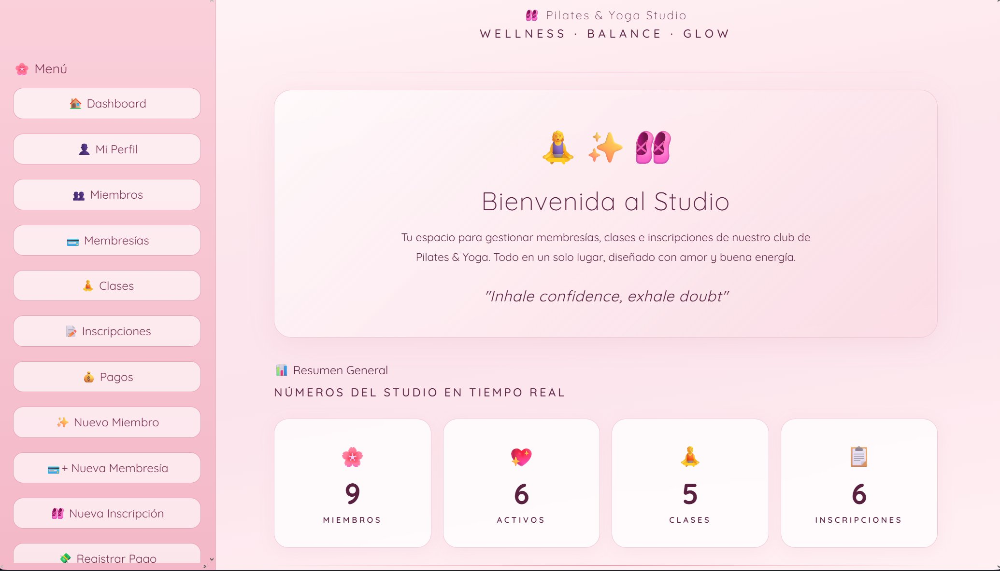

### 📊 Dashboard — Gráficas Analíticas (Top Clases, Membresías, Pagos, Asistencia)
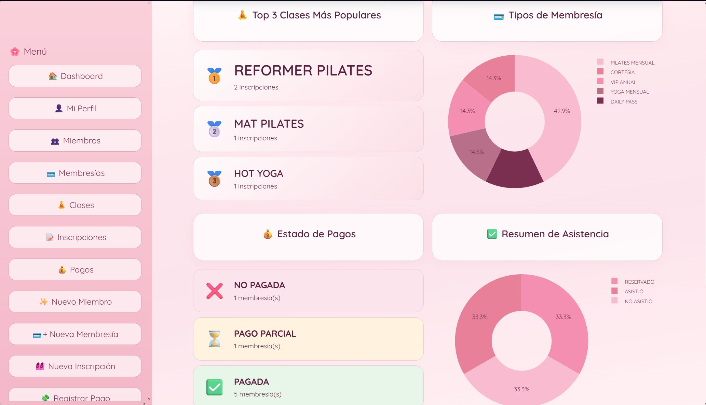

### 💵 Dashboard — Total Recaudado y Cartera Pendiente
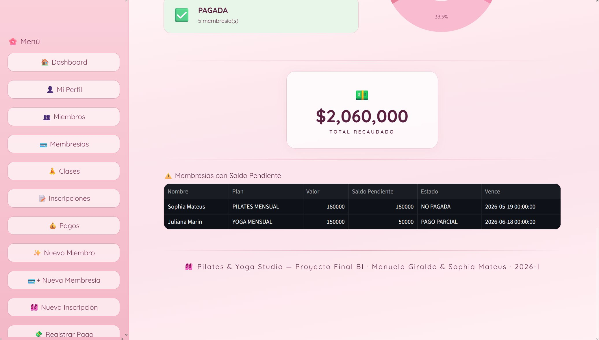

### 👤 Mi Perfil — Datos del Miembro y Membresía Activa
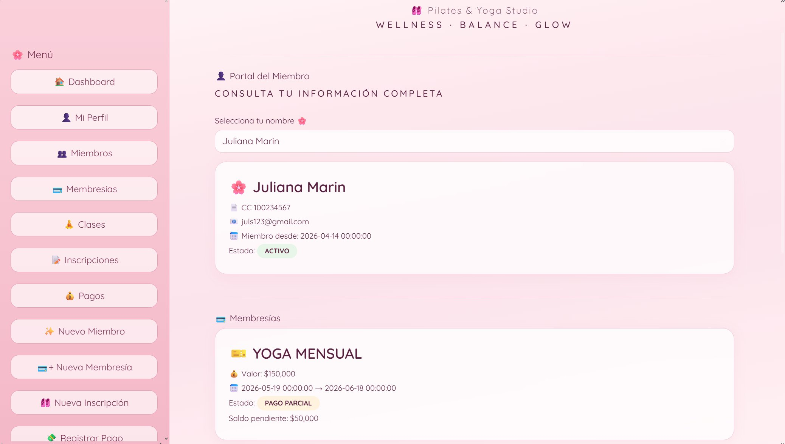

### 👤 Mi Perfil — Clases Reservadas e Historial de Pagos
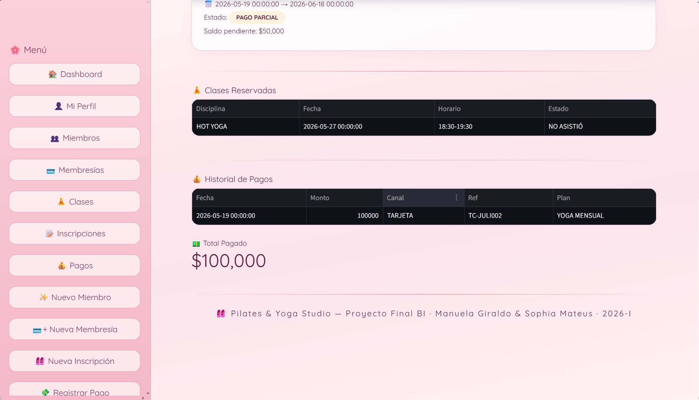

### 👥 Miembros — Maestro de Clientes con Filtro por Estado
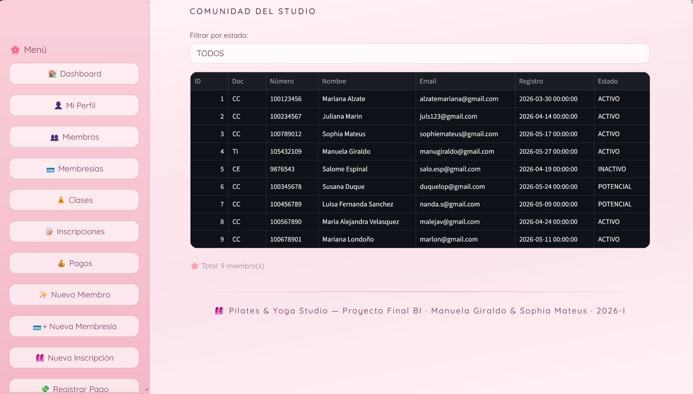

### 💳 Membresías — Planes Activos con Estado de Pago
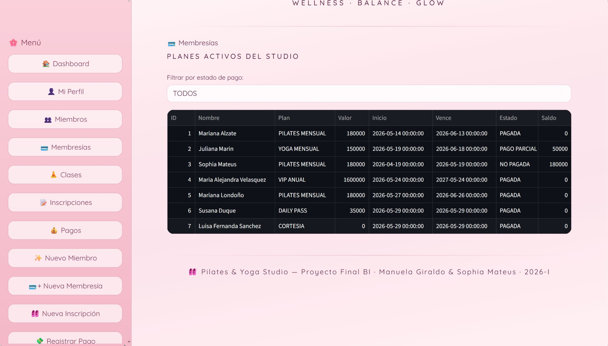

### 🧘 Clases — Agenda con Cupos Disponibles en Tiempo Real
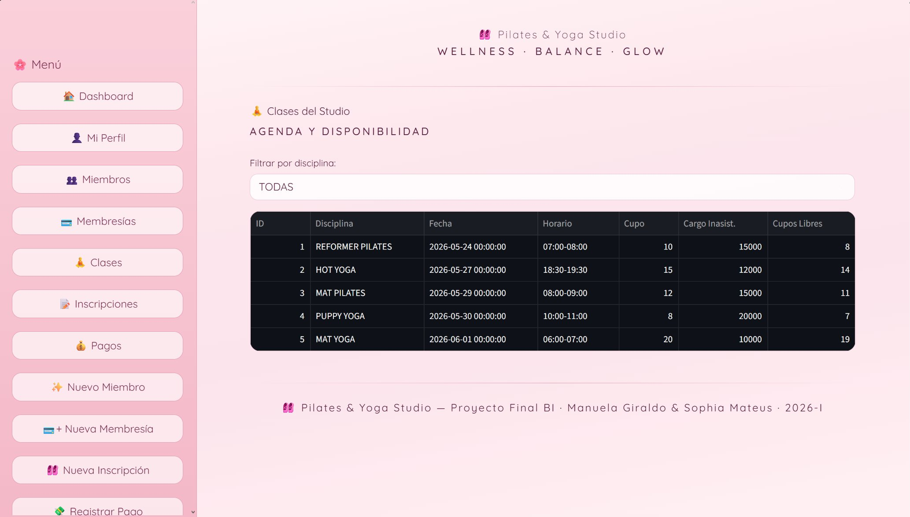

### 📝 Inscripciones — Registro de Reservas y Asistencia
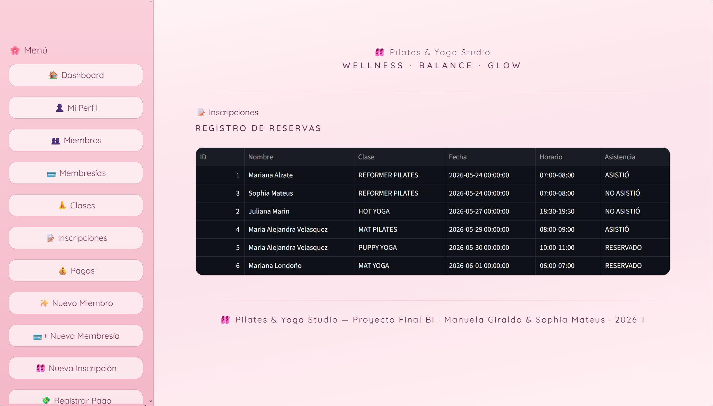

### 💰 Pagos — Historial de Transacciones y Total Recaudado
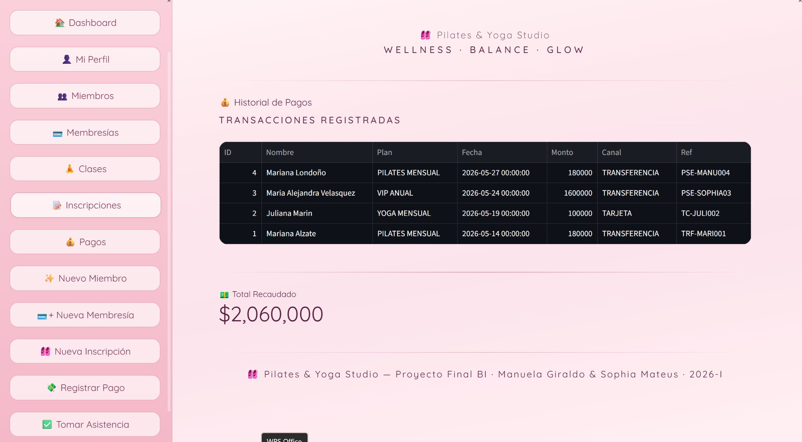

### ✨ Nuevo Miembro — Formulario de Registro
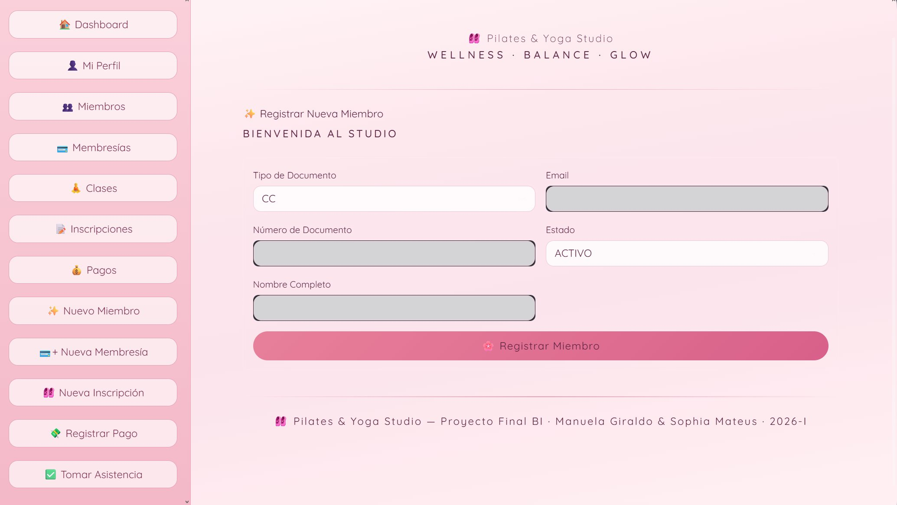

### 💳 Nueva Membresía — Asignar Plan con Precios Automáticos
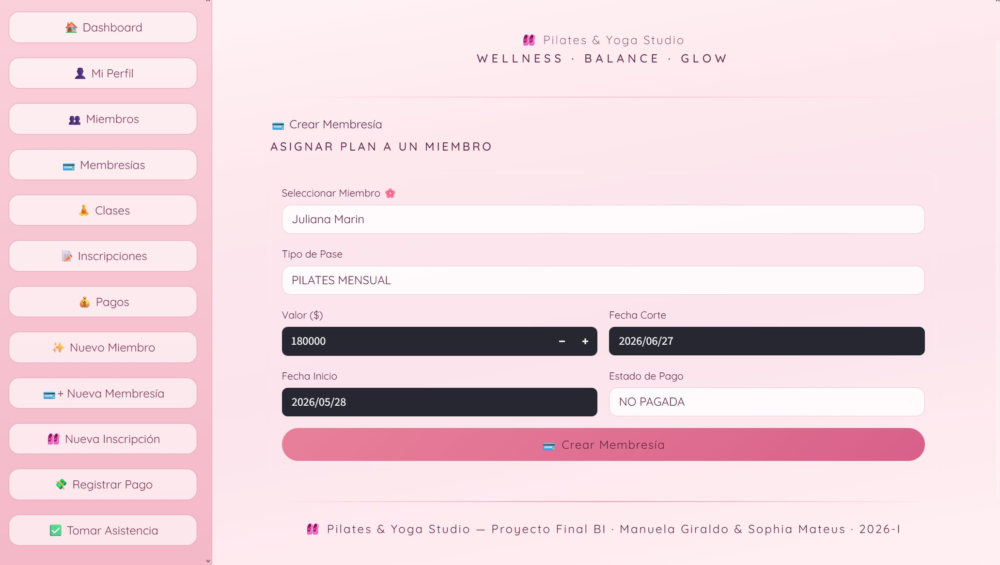

### 🩰 Nueva Inscripción — Reservar Spot en Clase
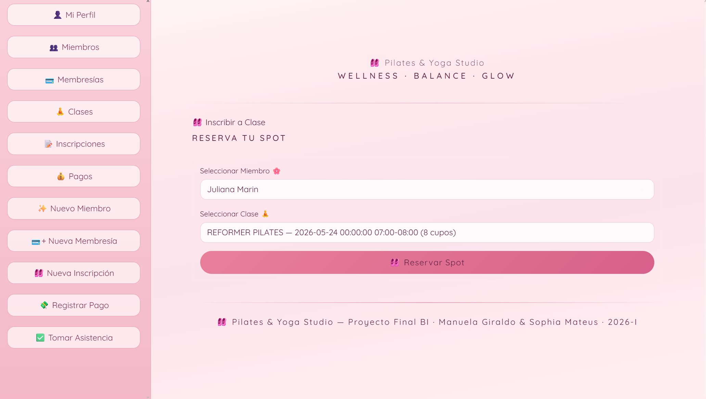

### 💸 Registrar Pago — Abonar a Membresía con Actualización de Saldo
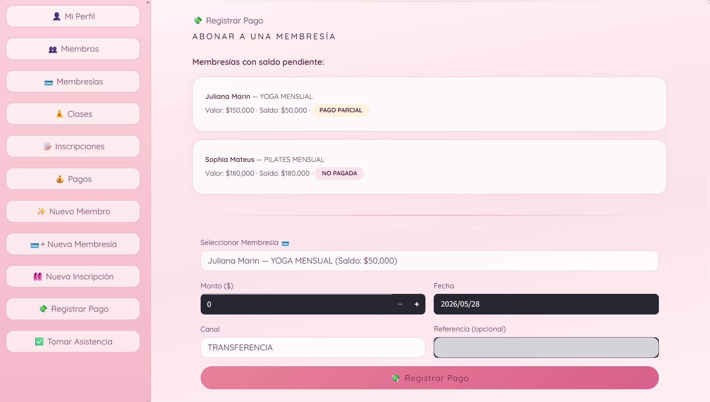

### ✅ Tomar Asistencia — Control de Asistencia por Clase
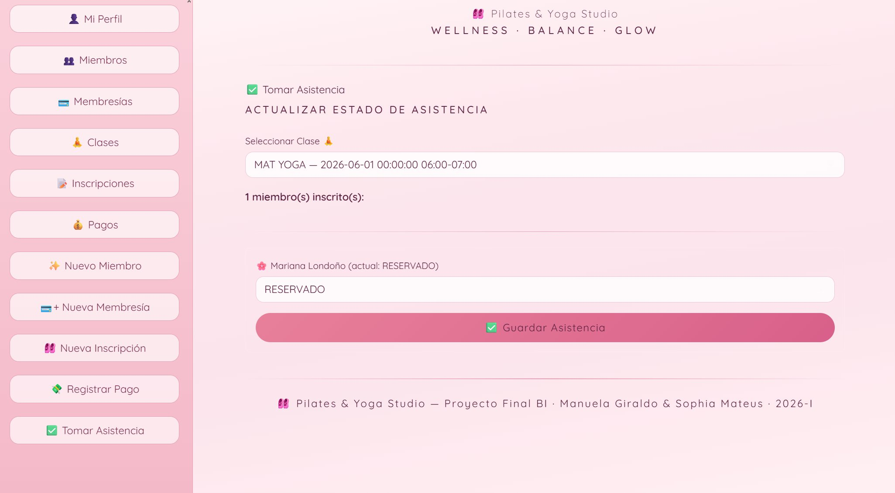

---

## 🚀 Instrucciones para Ejecutar la Aplicación Localmente

### Prerrequisitos
- Python 3.9 o superior.
- Oracle Instant Client instalado y configurado en la máquina local.
- Acceso a la base de datos a través del esquema del grupo (`G06_E02`).

### Pasos para Configuración

1. **Descargar el entorno de desarrollo:**
   ```bash
   git clone https://github.com/sophiamg0228-jpg/Pilates_manuela_sophia_BI.git
   cd Pilates_manuela_sophia_BI
   ```

2. **Instalar los módulos requeridos:**
   ```bash
   pip install -r requirements.txt
   ```

### Configuración de Conexión en el Código

Para simplificar la evaluación del profesor y adaptarnos al entorno del laboratorio, las credenciales de acceso se parametrizan directamente en el bloque de inicialización del archivo `App/connection.py`. No se requieren configuraciones en archivos externos `.env` ni wallets con contraseña.

El bloque de conexión base se maneja así:

```python
import oracledb

oracledb.init_oracle_client(lib_dir=r"C:\oracle\instantclient_23_26")

connection = oracledb.connect(
    user="G06_E02",
    password="SU_CONTRASEÑA",
    dsn="adbg06_low"
)
```

> Reemplazar `lib_dir` con la ruta real del Oracle Instant Client en la máquina donde se ejecute la aplicación.

3. **Cargar la base de datos** (si es la primera vez):
   - Ejecutar el script `Scripts/ddl.sql` para levantar la arquitectura de tablas.
   - Ejecutar el script `Scripts/dml.sql` para poblar el sistema con los datos de prueba.

4. **Correr el tablero:**
   ```bash
   streamlit run App/app.py
   ```

---

## 💭 Reflexión del Equipo

### Dificultades Encontradas

- **Sincronización de Secuencias en Oracle:** Uno de los mayores retos técnicos surgió al ejecutar pruebas masivas con el archivo DML. Las inserciones repetitivas desfasaban los contadores automáticos (`IDENTITY`), lo que generaba errores inmediatos de violación de integridad referencial (`ORA-02291`). Lo solucionamos reestructurando el orden lógico del borrado en cascada y forzando la limpieza de secuencias desde el DDL para que los IDs siempre inicien de forma consistente desde 1.
- **Validación de la Lógica Transaccional:** Coordinar el flujo en Python para asegurar que la penalización por una inasistencia impactara el saldo del cliente al instante, controlando en el backend que estas transacciones automáticas no generaran inconsistencias numéricas ni de lógica contable.

### Aprendizajes Clave

- **El Modelo Relacional como motor analítico:** Entendimos que estructurar correctamente las restricciones y tipos de datos desde SQL (como la segmentación fina de estados en los miembros) ahorra cientos de líneas de código de validación en el frontend de Python y simplifica la creación de gráficos limpios en Plotly.
- **Mentalidad de Business Intelligence en Operaciones:** El diseño de este proyecto nos demostró que registrar un usuario en el sistema no lo convierte automáticamente en un cliente rentable. Diferenciar conceptualmente entre leads y clientes activos nos permitió plantear métricas reales de negocio (como tasas de conversión y conversión de pases diarios), esenciales para liderar la toma de decisiones estratégicas.
